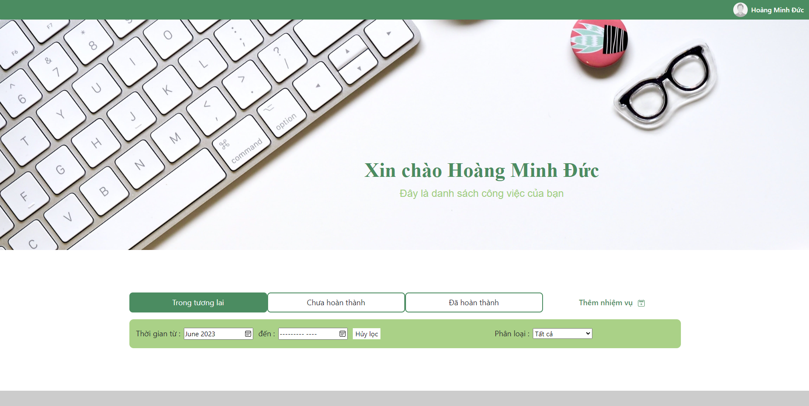
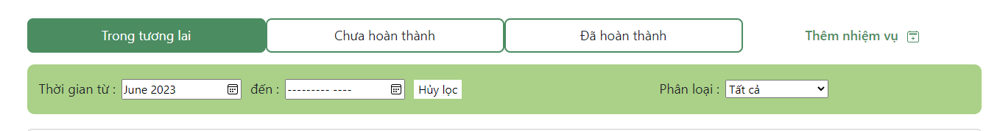
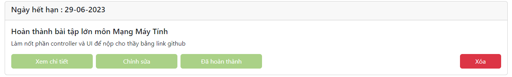
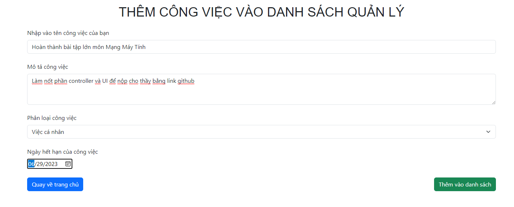

# TodoList ReactJS + NodeJS

## Mô tả chương trình

Đây là chương trình quản lý công việc được mình làm ra nhằm thực hành và trau dồi kỹ năng làm việc và xử lý logic với HTML,CSS,Javascript,ReactJS làm FrontEnd và NodeJS làm BackEnd
Các chức năng chính của chương trình:
-Đăng nhập,đăng xuất
-Thêm công việc,chỉnh sửa và xóa nội dung công việc
-Đánh dấu công việc đã hoàn thành
-Lọc danh sách công việc theo ngày tháng, loại công việc (việc cá nhân,việc nhà,việc cơ quan)

## Nếu bạn vào trang web với mục đích kiểm tra độ chính xác của chương trình

Hãy dùng tài khoản và mật khẩu sau đây :
Tài khoản : test123@gmail.com
Mật khẩu : test123

-   Trong tài khoản này,tôi đã thêm dữ liệu ở nhiều trường hợp ngày tháng khác nhau,bạn có thể dùng các chức năng như filter để test
-   Sau khi đăng nhập vào trang web, bạn cũng có thể đọc hướng dẫn ở dưới đây

## Hướng dẫn sử dụng

### Màn hình chính :

-   "Trong tương lai" là danh sách những công việc sắp tới mà bạn cần hoàn thành
-   "Chưa hoàn thành" là danh sách những công việc trong quá khứ mà bạn chưa hoàn thành
-   "Đã hoàn thành" là tổng hợp danh sách những công việc mà bạn đã hoàn thành"

### Phần filter :

-   "Trong tương lai" là danh sách những công việc sắp tới mà bạn cần hoàn thành
-   "Chưa hoàn thành" là danh sách những công việc trong quá khứ mà bạn chưa hoàn thành
-   "Đã hoàn thành" là tổng hợp danh sách những công việc mà bạn đã hoàn thành"
-   Bạn cũng có thể lọc danh sách công việc theo ngày tháng và loại công việc

### Phần tóm tắt một công việc :

-   Tại đây,bạn có thể thực hiện các thao tác với công việc đó

### Thêm một công việc mới :

